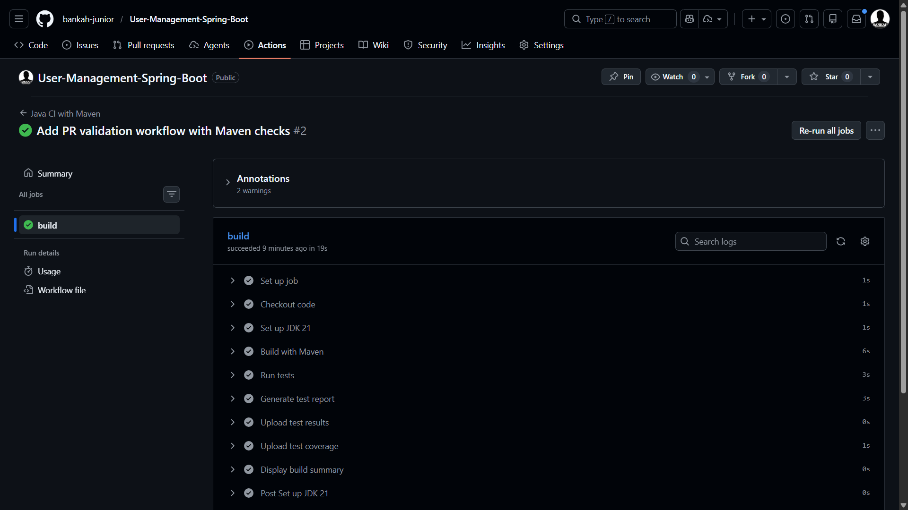
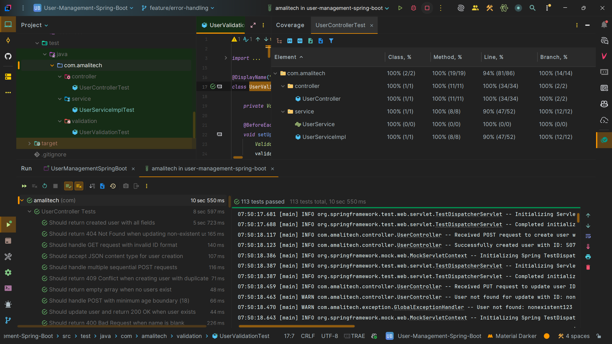

# User Management Spring Boot


[](https://www.oracle.com/java/)
[](https://spring.io/projects/spring-boot)
[](https://www.mongodb.com/)
[](#testing)

A production-ready User Management REST API built with Spring Boot, featuring comprehensive CRUD operations, MongoDB integration, automated testing, and CI/CD pipeline.

## 📋 Table of Contents
- [Overview](#overview)
- [Features](#features)
- [Technology Stack](#technology-stack)
- [CI/CD Pipeline](#cicd-pipeline)
- [Testing](#testing)
- [API Documentation](#api-documentation)
- [Getting Started](#getting-started)
- [API Endpoints](#api-endpoints)
- [Monitoring & Health Checks](#monitoring--health-checks)
- [Project Structure](#project-structure)
- [Contributing](#contributing)

## Overview
A robust User Management application built with Spring Boot providing RESTful API endpoints for complete CRUD operations on user entities with MongoDB integration, comprehensive validation, and enterprise-grade error handling.

## Task Status
- **US-001**: ✅ Create User Endpoint
- **US-002**: ✅ Get All Users Endpoint
- **US-003**: ✅ Get User by ID Endpoint
- **US-006**: ✅ Input Validation
- **US-008**: ✅ CI/CD Pipeline Setup

## Features
- ✅ **RESTful API** - Complete CRUD operations
- ✅ **User Management** - Create, Read, Update, Delete users
- ✅ **Input Validation** - Bean Validation with custom error messages
- ✅ **Unique Email Enforcement** - Prevents duplicate email addresses
- ✅ **MongoDB Integration** - NoSQL database with MongoTemplate
- ✅ **Exception Handling** - Global exception handler with structured error responses
- ✅ **API Documentation** - Interactive Swagger/OpenAPI documentation
- ✅ **Comprehensive Testing** - Unit, integration, and validation tests
- ✅ **CI/CD Pipeline** - Automated build and test with GitHub Actions

## API Documentation

### Swagger UI
Access the interactive API documentation at:
```
http://localhost:8080/swagger-ui.html
```

### OpenAPI Specification
View the raw OpenAPI specification at:
```
http://localhost:8080/api-docs
```

The Swagger UI provides:
- 📖 Complete API endpoint documentation
- 🧪 Interactive API testing interface
- 📋 Request/response examples
- ✅ Validation rules and constraints
- 🔍 Schema definitions

## API Endpoints

### Create User
```http
POST /api/v1/users
Content-Type: application/json

{
  "name": "John Doe",
  "email": "john@example.com",
  "age": 25
}
```
**Responses:**
- `201 Created` - User created successfully
- `400 Bad Request` - Validation failed
- `409 Conflict` - Email already exists

### Get All Users
```http
GET /api/v1/users
```
**Responses:**
- `200 OK` - Returns array of users

### Get User by ID
```http
GET /api/v1/users/{id}
```
**Responses:**
- `200 OK` - User found
- `404 Not Found` - User not found

### Update User
```http
PUT /api/v1/users/{id}
Content-Type: application/json

{
  "name": "John Updated",
  "email": "john.updated@example.com",
  "age": 30
}
```
**Responses:**
- `200 OK` - User updated successfully
- `400 Bad Request` - Validation failed
- `404 Not Found` - User not found
- `409 Conflict` - Email already exists

### Delete User
```http
DELETE /api/v1/users/{id}
```
**Responses:**
- `204 No Content` - User deleted successfully
- `404 Not Found` - User not found

## Validation Rules
- **Name**: Required, cannot be blank
- **Email**: Required, must be a valid email format, must be unique
- **Age**: Required, must be between 18 and 100

## Monitoring & Health Checks

### Actuator Endpoints
The application provides several monitoring endpoints:

**Health Check:**
```
GET http://localhost:8080/actuator/health
```
Returns application health status including MongoDB connection

**Application Info:**
```
GET http://localhost:8080/actuator/info
```
Returns application metadata and version information

**Metrics:**
```
GET http://localhost:8080/actuator/metrics
```
Returns available application metrics

**Loggers:**
```
GET http://localhost:8080/actuator/loggers
```
View and modify logging levels at runtime

### Health Response Example
```json
{
  "status": "UP",
  "components": {
    "mongo": {
      "status": "UP",
      "details": {
        "database": "usermanagement",
        "collections": 1,
        "status": "Connected"
      }
    },
    "ping": {
      "status": "UP"
    }
  }
}
```

### Logging
- **SLF4J with Logback** - Structured logging
- **Log Levels**: DEBUG for service/controller, INFO for general operations
- **Request/Response Logging** - All API operations logged
- **Error Tracking** - Stack traces for exceptions

## Technology Stack
- **Java 21** - Latest LTS version
- **Spring Boot 4.0.2** - Application framework
- **Spring Data MongoDB** - Database integration
- **Spring Boot Actuator** - Monitoring and health checks
- **SpringDoc OpenAPI** - API documentation (Swagger UI)
- **Spring Boot Validation** - Input validation
- **SLF4J & Logback** - Logging framework
- **MongoDB** - NoSQL database
- **Maven** - Build tool and dependency management
- **JUnit 5** - Testing framework
- **Mockito** - Mocking framework
- **Testcontainers** - Integration testing with MongoDB

## Getting Started

### Prerequisites
- **Java 21** or higher
- **Maven 3.6+**
- **MongoDB 7.0+** (or Docker for MongoDB)

### Installation

1. **Clone the repository**
   ```bash
   git clone https://github.com/bankah-junior/User-Management-Spring-Boot.git
   cd User-Management-Spring-Boot
   ```

2. **Build the project**
   ```bash
   mvn clean install
   ```

3. **Run tests**
   ```bash
   mvn test
   ```

4. **Start the application**
   ```bash
   mvn spring-boot:run
   ```

The application will start on `http://localhost:8080`

### Quick Start with Docker (MongoDB)
```bash
docker run -d -p 27017:27017 --name mongodb mongo:7.0
mvn spring-boot:run
```

## CI/CD Pipeline

This project uses **GitHub Actions** for continuous integration and deployment with automated builds and comprehensive testing on every push.



### Pipeline Features
- ✅ **Automated Builds** - Triggers on push to main/master and pull requests
- ✅ **JDK 21** setup with Temurin distribution
- ✅ **Maven Dependency Caching** - Optimizes build time
- ✅ **Automated Testing** - Runs all 113 unit and integration tests
- ✅ **Test Report Generation** - Detailed test results and coverage
- ✅ **Test Coverage Upload** - Automated coverage reporting
- ✅ **Build Summary** - Comprehensive build status in GitHub Actions
- ✅ **Artifact Management** - Uploads test results as artifacts

The pipeline ensures code quality and reliability by running the full test suite on every commit, providing immediate feedback on build status and test results.

## Testing

The project maintains high code quality with **113 comprehensive tests** covering all layers of the application.



### Test Coverage
- ✅ **100% Class Coverage** (2/2 controllers, 1/1 services)
- ✅ **100% Method Coverage** (19/19 methods)
- ✅ **94% Line Coverage** (81/86 lines)
- ✅ **100% Branch Coverage** (14/14 branches)

### Test Types
- **Controller Tests** - REST endpoint validation and response testing
- **Service Tests** - Business logic and integration testing
- **Validation Tests** - Input validation and constraint testing
- **Integration Tests** - End-to-end scenarios with Testcontainers

## Project Structure
```
src/
├── main/
│   ├── java/com/amalitech/
│   │   ├── controller/      # REST controllers
│   │   ├── model/           # Domain models
│   │   ├── service/         # Business logic
│   │   ├── exception/       # Custom exceptions and handlers
│   │   └── repository/      # Data access layer
│   └── resources/
│       └── application.properties
└── test/
    └── java/com/amalitech/
        ├── controller/      # Controller tests
        ├── service/         # Service tests
        └── validation/      # Validation tests
```

## Development

### Running Tests
```bash
# Run all tests
mvn test

# Run specific test class
mvn test -Dtest=UserServiceImplTest

# Run with coverage report
mvn clean test jacoco:report
```

## Contributing
1. Fork the repository
2. Create a feature branch
3. Commit your changes
4. Push to the branch
5. Create a Pull Request

## License
This project is licensed under the MIT License.

## Author
Anthony Bekoe Bankah

## Acknowledgments
- Spring Boot Documentation
- MongoDB Documentation
- GitHub Actions Documentation

